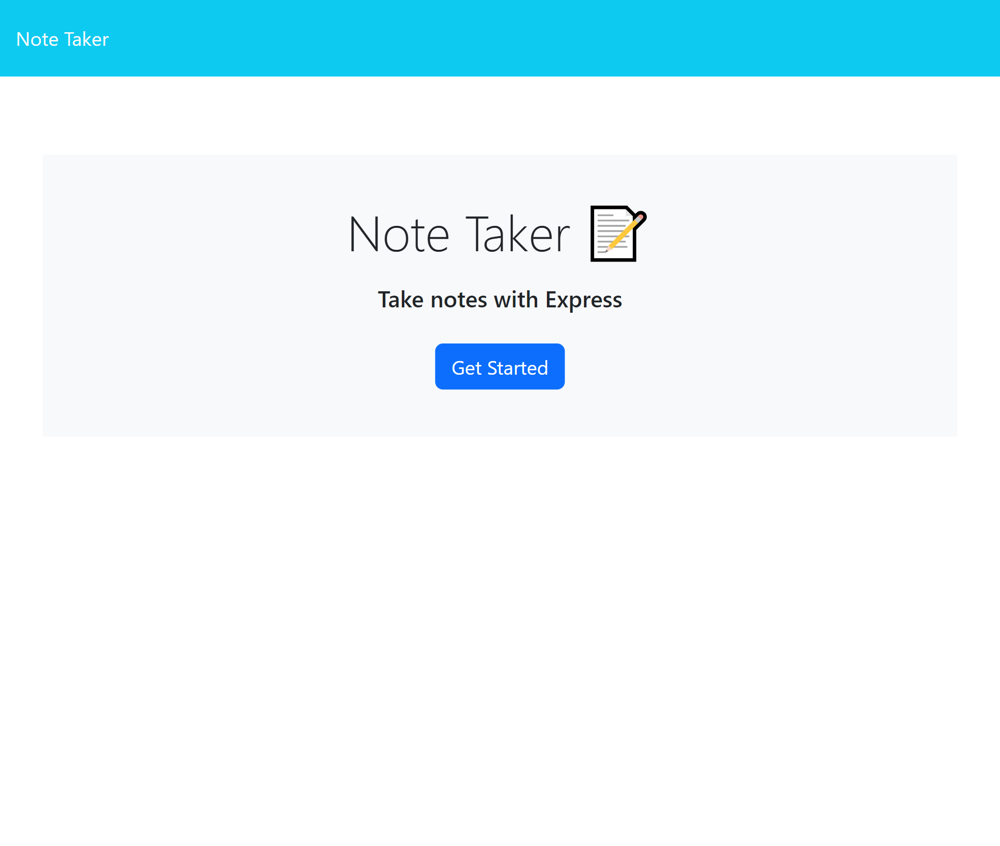
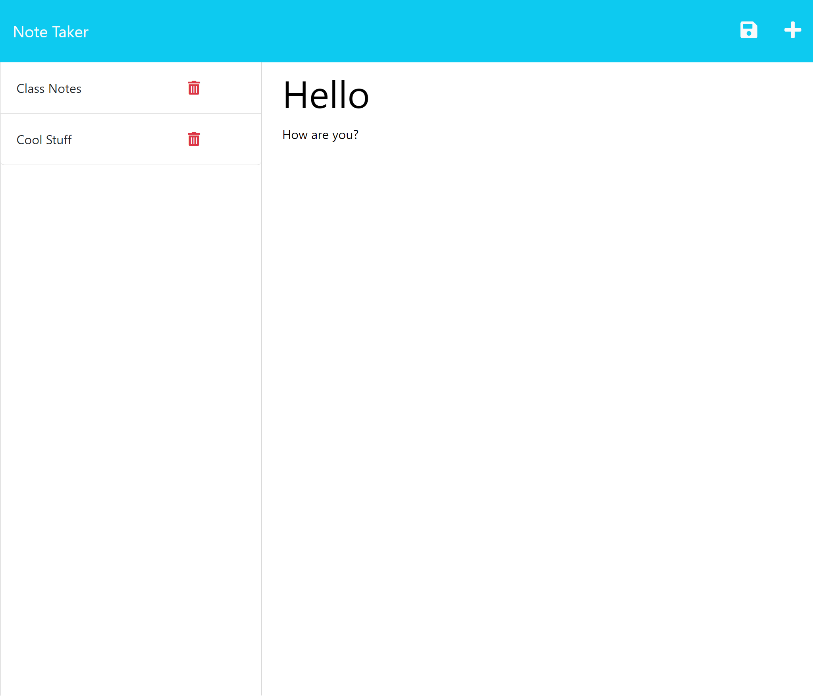

# Express.js Note Taker

## Description

https://dnoon23.github.io/portfolio/

This project was to create a note taker based on code provided.  The note taker needed to be able to save and delete notes writen in the browser as well as retreve any saved notes.  The user should also be able to naviage from the home page to the note taking page.  The most difficult part of this project was the routing.  I tried various means.  First using an injector, then using fs to write the files in the routes, and finally I settled on using and modifying helpers which were used in examples from the curriculum.

## Installation

N/A

## Usage

To run the code, if taken from the Github repo, you start by opening the directory in the terminal.  Then install the dependancies using `npm install`.  Node must also be installed.  Then in the terminal type `node server.js` to start the server.  A notification in the terminal will say the PORT and have a link that can be clicked to navigate to the site using the default browser.  Once on the homepage, click on the "Get Started" button to navigate to the note taking page.  On the left side of the screen will be saved notes, if any, and in the middle will be 2 input fields, one for the title of the note and one for the body of the note.  Click in the field and type your desired title and note.  Once both fields have something written a save icon will apper in the upper right of the page.  Clicking it will create a note on the left represented by what was input into the title field and clear the 2 fields making it ready for a new note.  With a note created you can now click on the title of the note on the left side of the screen to bring the note back up to be reviewed.  Notes cannot be edited but to the right of the note titles will be a red trash can which can be clicked to delete the note.  While reviewing notes, in the upper left there is a + icon which can be used to bring up the blank notes fields to create more notes.

Heroku deployment: 

## Credits

Some code modified from code taken from: 
https://git.bootcampcontent.com/

## License

N/A

## Features

This page features node as well as express routing to navigate pages, display notes, save notes, and delete notes.